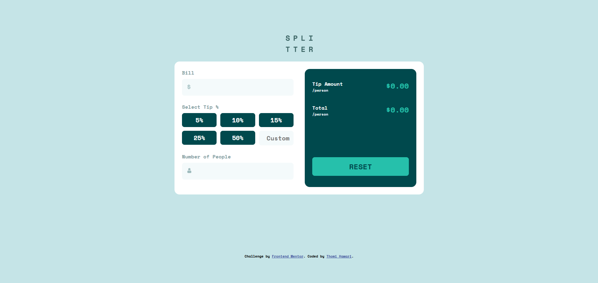

# Frontend Mentor - Tip calculator app solution

This is a solution to the [Tip calculator app challenge on Frontend Mentor](https://www.frontendmentor.io/challenges/tip-calculator-app-ugJNGbJUX). Frontend Mentor challenges help you improve your coding skills by building realistic projects.

## Table of contents

- [Overview](#overview)
  - [The challenge](#the-challenge)
  - [Screenshot](#screenshot)
  - [Links](#links)
- [My process](#my-process)
  - [Built with](#built-with)
  - [What I learned](#what-i-learned)
  - [Continued development](#continued-development)
- [Author](#author)

**Note: Delete this note and update the table of contents based on what sections you keep.**

## Overview

### The challenge

Users should be able to:

- View the optimal layout for the app depending on their device's screen size
- See hover states for all interactive elements on the page
- Calculate the correct tip and total cost of the bill per person

### Screenshot

### Links

- Solution URL: [solution URL here](https://github.com/thomi-h/frontend-mentor-tip-calculator)
- Live Site URL: [live site URL here](https://thomi-h.github.io/frontend-mentor-tip-calculator/)

## My process

### Built with

- Semantic HTML5 markup
- CSS custom properties
- Flexbox
- CSS Grid
- Mobile-first workflow

### What I learned

I learned that to when input type radio is clicked the change than can be made is from their label. So, here the background color change when it is cliked is from the label element.

Also I learned that to get the value of input radio we can just simple querySelector for the checked element.

In this project I also tried to make one validate function that I can use for both input for bill and number of people and divide function into small sizing which handle one specific purpose like calculate tip, and update UI.

### Continued development

In the next project I will try more to make single responsible function and try to make my code "DRY" with function that is reusable.

## Author

- Frontend Mentor - [@thomi-h](https://www.frontendmentor.io/profile/thomi-h)
- LinkedIn - [@thomihawari](https://www.linkedin.com/in/thomihawari/)
